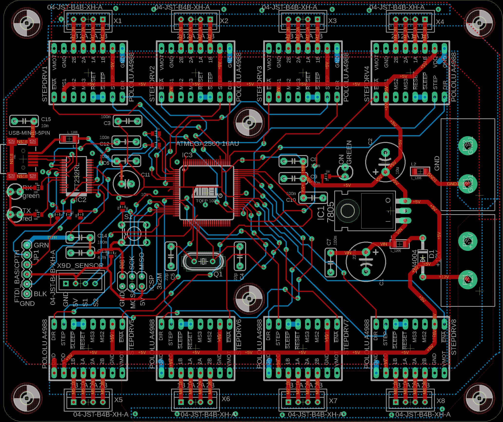
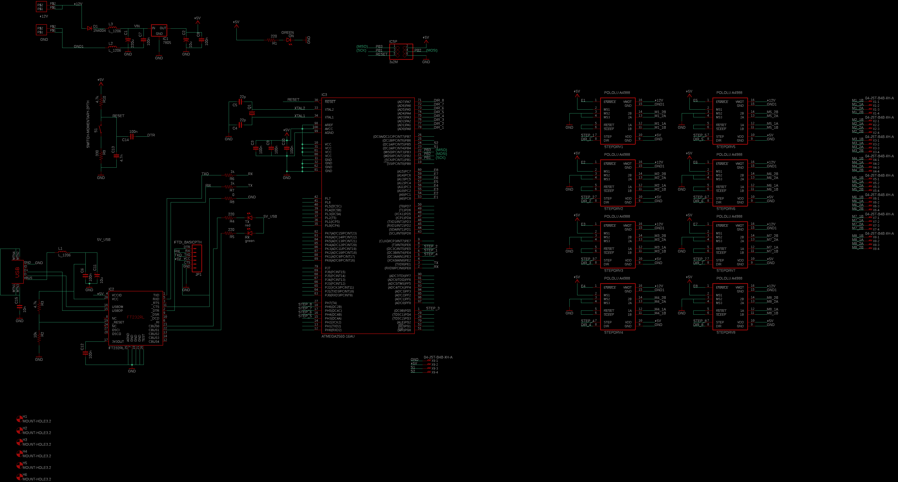

# DRIVER_8-MOTOR_MEGA_DISTANCE_SENSOR_V1.0

## Descripción

Este proyecto consiste en el diseño de una placa electrónica (PCB) para el control de hasta 8 motores y la integración de sensores de distancia, ideal para aplicaciones de robótica, automatización y sistemas embebidos. El diseño está basado en el microcontrolador ATMEGA2560, ampliamente utilizado en plataformas como Arduino MEGA, lo que facilita la programación y expansión del sistema.

La placa permite el uso de módulos para motores paso a paso como el Pololu A4988 o similares, y la conexión de sensores ultrasónicos para la detección de presencia o distancia.

## Aplicación artística

Esta placa fue utilizada en un proyecto de arte donde un cuadro contenía una figura de un anciano en bronce, cuyas partes se desarmaban automáticamente al detectar la presencia de una persona frente al cuadro mediante un sensor ultrasónico. Cuando no se detectaba presencia, el cuadro se rearmaba. También era posible invertir el comportamiento: el cuadro se reordenaba cuando había presencia.

## Características principales

- **Control de 8 motores:** Permite manejar hasta 8 motores de manera independiente mediante módulos A4988 o compatibles.
- **Sensores de distancia:** Integración sencilla de sensores ultrasónicos para medición de distancias o detección de presencia.
- **Microcontrolador ATMEGA2560:** 256 KB de memoria Flash, 8 KB de SRAM, 4 KB de EEPROM, 86 pines de I/O, 16 canales ADC de 10 bits, 12 canales PWM de 16 bits, 4 puertos USART.
- **Conectores estándar:** Pines y headers compatibles con módulos y shields comunes.
- **Archivos Gerber incluidos:** Listos para fabricación profesional de la PCB.

## Archivos incluidos

- `DRIVER_8 MOTOR_MEGA_DISTANCE_SENSOR_V1.0.sch`: Esquemático del circuito.
- `DRIVER_8 MOTOR_MEGA_DISTANCE_SENSOR_V1.0.brd`: Diseño de la PCB.
- Archivos Gerber (`.GBL`, `.GTL`, `.GBO`, `.GTO`, etc.): Para fabricación de la placa.
- `Board.png`: Imagen de la PCB.
- `Schematic.png`: Imagen del esquemático.
- `.TXT`, `.gpi`: Archivos de taladros y detalles de fabricación.

## Uso

1. **Revisión del diseño:** Consulta las imágenes incluidas para visualizar el esquemático y la PCB.
2. **Fabricación:** Utiliza los archivos Gerber para mandar a fabricar la placa en cualquier servicio profesional.
3. **Montaje:** Ensambla los componentes siguiendo el esquemático. Instala los módulos A4988 o similares en los zócalos correspondientes y conecta el sensor ultrasónico en el header designado.
4. **Programación:** Utiliza el entorno de Arduino o AVR para cargar el firmware al ATMEGA2560.

## Créditos

- Diseño original por Rodrigo Urquieta.
- Basado en el microcontrolador ATMEGA2560.

--- 